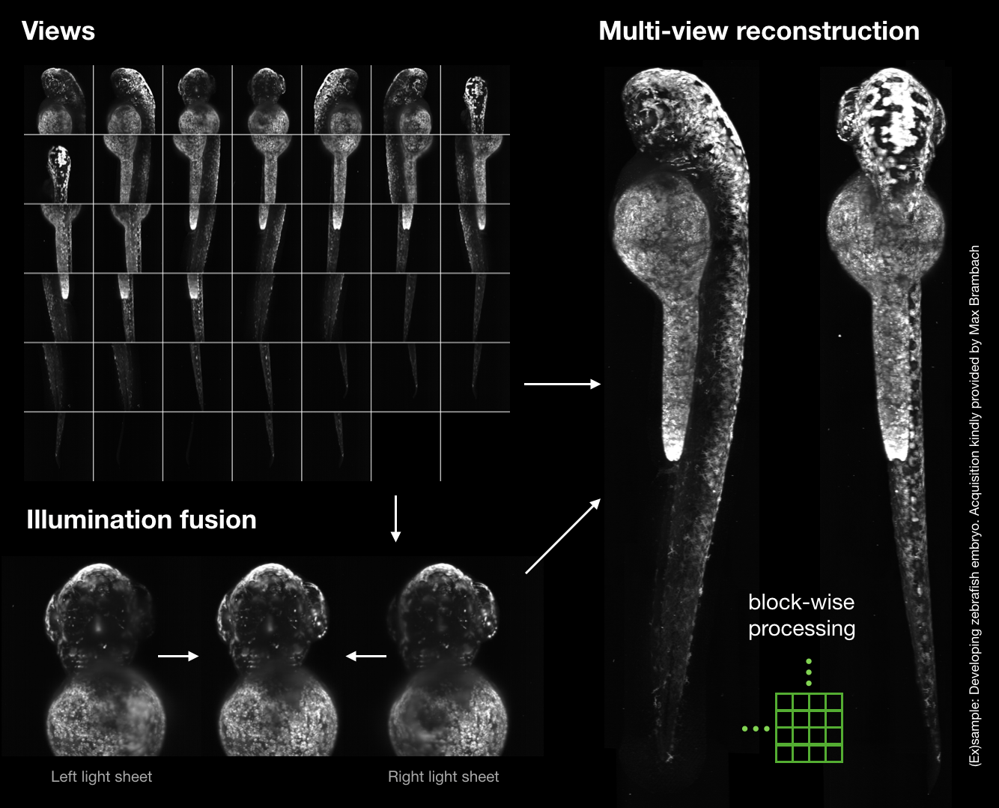
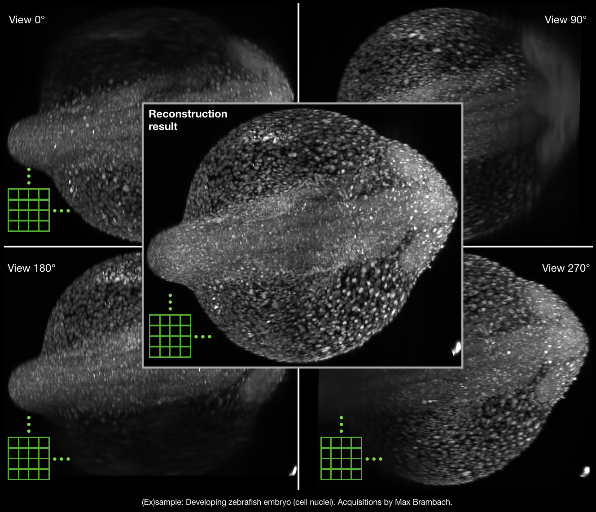

# MVRegFus

**M**ulti-**V**iew **Reg**istration and **Fus**ion

Python module to process multi-view light sheet data. This includes

1) image registration
    - view registration
    - time registration (drift correction)
    - channel registration (affine chromatic aberration correction)
    
2) view fusion
    - weighted additive fusion
    - multi-view deconvolution (Richardson Lucy)
        - traditional
        - weighted
    - for both fusion methods, weights can be chosen from:
        - blending weights
        - weights based on an image quality metric
        
- Additional features:

    - processing pipeline is leveraged by [`dask`](http://dask.org)
        - entire workflow can be executed on laptops, independently of dataset size
        - execution on computational clusters using `dask.distributed`
    - GPU accelerated multi-view deconvolution (using CuPy)

Notes:
- currently, only czi files from Z1 microscopes are supported out of the box

 

MVRegFus uses the [elastix](https://elastix.lumc.nl/) registration toolkit for performing most image registrations.


## Installation instructions

1) Use anaconda and install an environment from the provided .yml file:
`conda env create --file mv_environment.yml`

2) [Download elastix](https://elastix.lumc.nl/download.php) (binary version suitable for your platform) and place files into a folder 'elastix' in the same folder as this project, as such:
```bash
./MVRegFus
./MVRegFus/bin
...
./elastix
./elastix/bin
./elastix/lib
```

You're set!

## Usage

- open terminal / anaconda prompt

- activate the previously installed anaconda environment:
```conda activate mvregfus``` (Win,MacOS) or
```source activate mvregfus``` (Linux)

- copy `mvregfus/bin/mvregfus_bin.py` to `<your_mvregfus_bin.py>` (can be placed next to data) and use as a template to indicate the location of your files, resolution, etc. (see comments in file). Soon configuration file handling will be added

- run fusion from the terminal with
```python <your_mvregfus_bin.py>```

## Dependencies

Python libraries:
- numpy, scipy
- h5py
- dask
- distributed
- dipy
- SimpleITK
- scikit-image
- bcolz
- tifffile (included)
- czifileczifile==2019.1.26 (included)
- cupy (optional)

External:
- elastix (install binary and indicate path at the beginning of dipy_multiview.py)
- SimpleElastix (optional)